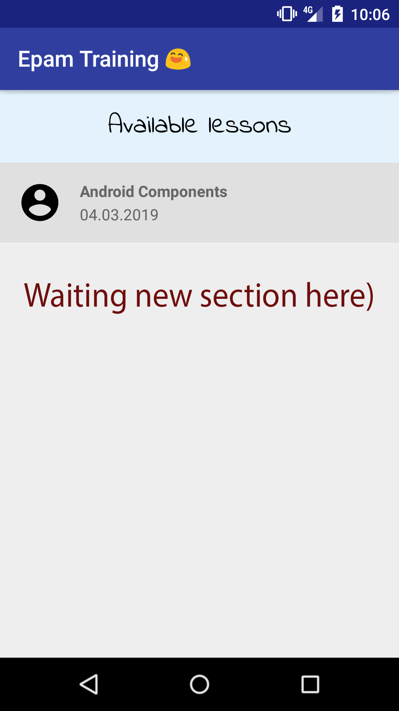

Nice to see you in this document 😉

I think, you feel like 🤯 or 😰 after lesson, but let's learn Android step by step

# You homework contains 2 parts:

# 1. First task (you make changes in our repository and then create pull requst):

1. Add `Android UI` lesson in project application
  * use `include` tag;
  * add mentor name for all available lessons;
  * make opening lesson screen.
  * attach screenshow with result (inside _assets_ folder)
    
Open `activity_lessons.xml` and will see `include` tag. It is very useful thing to reuse xml layouts or extract big layout to small components.

https://developer.android.com/training/improving-layouts/reusing-layouts

👌🏻 First correct pull request will be merged.

# 2. Second task.

for all these subtasks:
* attach result screenshot
* attach screenshot with enable *Show layout bounds*
* attach screenshot with enable *Debug GPU overdraw*

1. VK profile page

2. Google Podcasts

